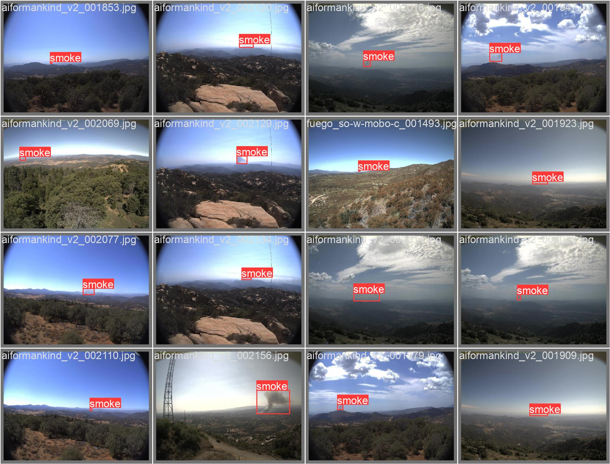

# Pyronear: Machine Learning Pipeline for Wildfire Detection 🔥


Machine Learning Pipeline for Wildfire Detection.


## Setup

### Dependencies

- [Poetry](https://python-poetry.org/): Python packaging and dependency
management - Install it with something like `pipx`
- [Git LFS](https://git-lfs.com/): Git Large File Storage replaces large
files such as jupyter notebooks with text pointers inside Git while
storing the file contents on a remote server like github.com
- [DVC](https://dvc.org/): Data Version Control  - This will get
installed automatically
- [MLFlow](https://mlflow.org/): ML Experiment Tracking - This will get
installed automatically

### Install

#### Poetry

Follow the [official documentation](https://python-poetry.org/docs/) to install `poetry`.

#### Git LFS

Make sure [`git-lfs`](https://git-lfs.com/) is installed on your system.

Run the following command to check:

```sh
git lfs install
```

If not installed, one can install it with the following:

##### Linux

```sh
sudo apt install git-lfs
git-lfs install
```

##### Mac

```sh
brew install git-lfs
git-lfs install
```

##### Windows

Download and run the latest [windows installer](https://github.com/git-lfs/git-lfs/releases).

#### Project Dependencies

Create a virtualenv and install python version with conda - or use a
combination of pyenv and venv:

```sh
conda create -n pyronear-mlops python=3.12
```

Activate the virtual environment:

```sh
conda activate pyronear-mlops
```

Install python dependencies

```sh
poetry install
```

#### Data Dependencies

To get the data dependencies one can use DVC - To fully use this
repository you would need access to our DVC remote storage which is
currently reserved for Pyronear members.

Once setup, run the following command:

```sh
dvc pull
```

___Note:___ To download the dataset used to train the models, use the
following command: `./scripts/data/download.sh`.



## Project structure and conventions

The project is organized following mostly the [cookie-cutter-datascience
guideline](https://drivendata.github.io/cookiecutter-data-science/#directory-structure).

### Data

All the data lives in the `data` folder and follows some [data engineering
conventions](https://docs.kedro.org/en/stable/faq/faq.html#what-is-data-engineering-convention).

### Library Code

The library code is available under the `pyronear_mlops` folder.

### Notebooks

The notebooks live in the `notebooks` folder. They are automatically synced to the Git LFS storage.
Please follow [this
convention](https://drivendata.github.io/cookiecutter-data-science/#notebooks-are-for-exploration-and-communication)
to name your Notebooks.

`<step>-<ghuser>-<description>.ipynb` - e.g., `0.3-mateo-visualize-distributions.ipynb`.

### Scripts

The scripts live in the `scripts` folder, they are
commonly CLI interfaces to the library
code.

## DVC

DVC is used to track and define data pipelines and make them
reproducible. See `dvc.yaml`.

To get an overview of the pipeline DAG:

```sh
dvc dag
```

To run the full pipeline:

```sh
dvc repro
```

## MLFlow

An MLFlow server is running when running ML experiments to track
hyperparameters and performances and to streamline model
selection.

To start the mlflow UI server, run the following command:

```sh
make mlflow_start
```

To stop the mlflow UI server, run the following command:

```sh
make mlflow_stop
```

To browse the different runs, open your browser and navigate to the URL: [http://localhost:5000](http://localhost:5000)

## Contribute to the project

### New ML experiments

1. Work on a separate git branch:

```sh
git checkout -b "<user>/<experiment-name>"
```

2. Modify and iterate on the code, then run `dvc repro`. It will rerun
   parts of the pipeline that have been updated.

3. Commit your changes and open a Pull Request to get your changes
   approved and merged.

### Run Random Hyperparameter Search

Use the following commands to run random hyperparameter search:

```sh
make run_hyperparameter_search
```

It will run 10 random training runs with hyperparameters drawn from the hyperparameter space defined in `pyronear_mlops/model/yolov8/hyperparameters.py`
